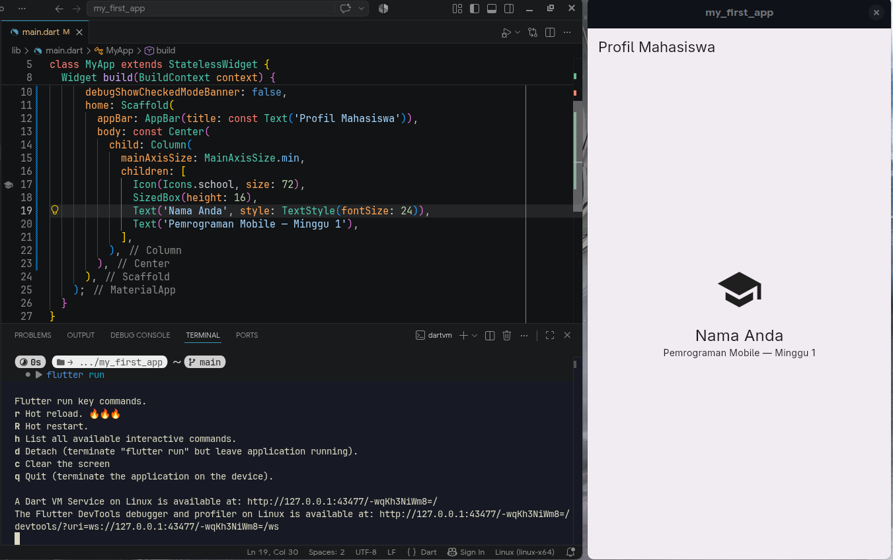
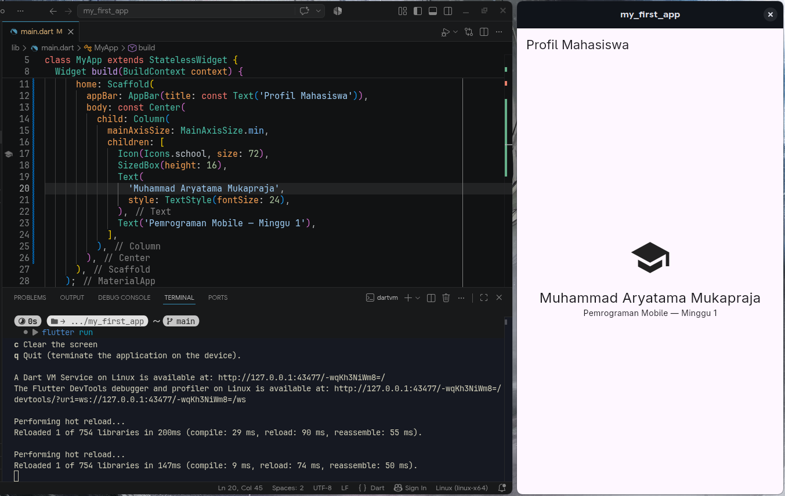
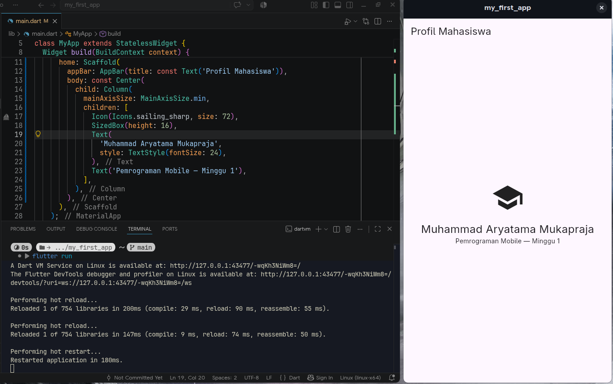
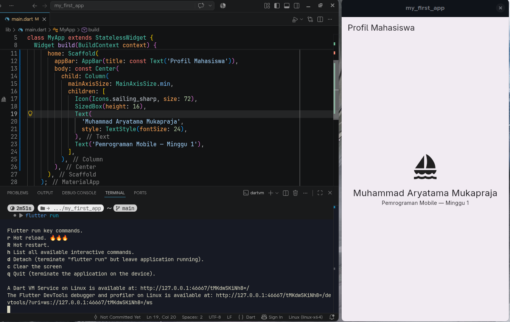
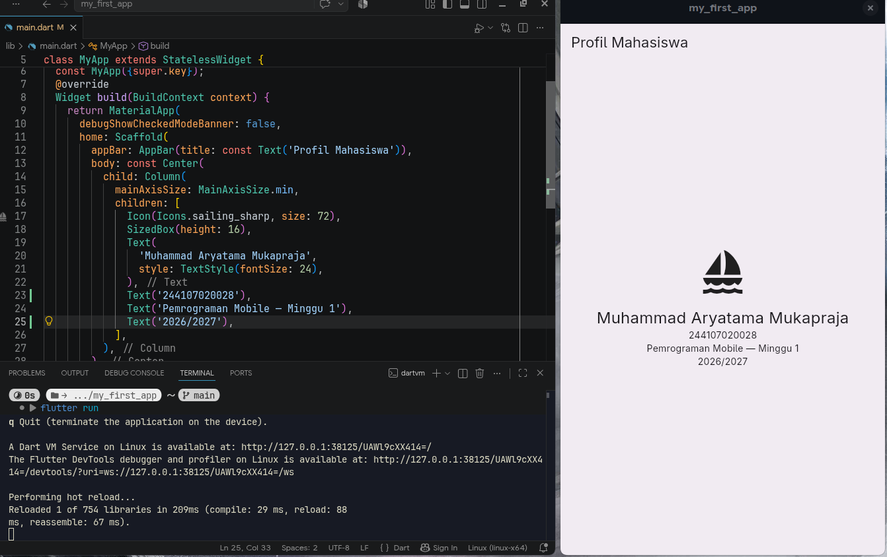

# Week 1

## Tujuan
- Menjelaskan evolusi pengembangan mobile serta perbedaan native, hybrid, dan cross-platform
- Menjelaskan arsitektur Flutter, peran Dart, struktur proyek, dan widget tree
- Mengulang dasar Dart: variabel, tipe data, fungsi, class, dan null safety
- Menyiapkan Flutter, Android SDK, emulator atau perangkat fisik, lalu menjalankan aplikasi pertama
- Mengubah UI awal Flutter dan menyimpan hasilnya pada repository Git pribadi

## Fitur Utama
- Membuat widget untuk tampilan (UI)
- Menunjukkan penggunaan variabel, tipe data, fungsi, dan class Dart

## Stack Teknologi
- **Visual Studio Code**: Text editor untuk memudahkan pengembangan
- **Flutter**: Framework UI untuk membangun aplikasi mobile, web, dan desktop
- **Dart**: Bahasa pemrograman yang digunakan oleh Flutter
- **Android SDK**: Tools dan library untuk pengembangan aplikasi Android (digunakan untuk emulator/perangkat fisik)
- **Git**: Sistem version control untuk mengelola kode proyek

## Cara Menjalankan
1. Pastikan Flutter SDK, Android SDK, dan Git telah bekerja serta extension Flutter di VSCode telah aktif
2. Clone repository di Command Prompt
```
    git clone https://github.com/MuhammadAryatamaM/my_first_app.git
    cd my_first_app
```
3. Ambil dependencies yang diperlukan
```
flutter pub get
```
4. Jalankan aplikasi dengan emulator/perangkat Android yang terhubung
```
flutter run
```
## Hasil yang Dicapai
### Environment untuk Pengembangan
Instalasi & Setup Flutter SDK, Android SDK, dan Extension Flutter di VSCode.

### Pemahaman Dasar Flutter & Dart
Dart adalah bahasa bertipe statis dengan inferensi tipe. File di `test/null-safety.dart` berisi latihan dasar-dasar dart seperti tipe data, function, class, null safety, dan sebagainya.

### Kustom UI Aplikasi
Berhasil menjalankan aplikasi Flutter di emulator dan mengubah tampilannya. Dapat melihat hasil perubahan kode secara cepat dengan `hot reload` dan `hot restart`.
| Bentuk Awal | Perubahan + Setelah Hot Reload |
| :---: | :---: |
|  |  |
| **Perubahan + Setelah Hot Restart** | **Setelah Aplikasi Dibuka Kembali** |
|  |  |

## Mini Assignment
> Buat aplikasi Profil Mahasiswa berdasarkan praktikum. Tambahkan NIM dan satu informasi tambahan menggunakan widget dasar.

Hasil kode tertera di `lib/main.dart`. Menggunakan `Text` untuk menambah text NIM dan Tahun, yang berada di `children`.



## Kendala yang Dialami
Saya memakai Linux, sehingga beberapa tutorial yang diberikan (Windows) tidak berlaku. Install Flutter lewat AUR tidak bisa, jadi harus clone repository Flutter. Command `flutter` juga tidak bekerja karena lupa tidak teregister oleh Terminal Laptop, padahal di Terminal VSCode bisa (ternyata karena Extension).
