# Week 2

## Tujuan

- Menjelaskan prinsip declarative UI dan hubungan antara widget, konfigurasi, serta state.
- Menggunakan StatelessWidget, StatefulWidget, Container, Row, Column, dan Expanded.
- Membedakan komponen Material 3 dan Cupertino untuk kebutuhan platform yang berbeda.
- Membangun layout responsif untuk ukuran layar mobile dan tablet.
- Menerapkan theme, dark mode, styling, dan aksesibilitas dasar.

## Fitur Utama

- Membuat aplikasi yang responsif
- Menggunakan komponen Material 3 atau Cupertino untuk UI
- Aksesibilitas untuk screen reader dan dark/light theme

## Hasil yang Dicapai

### Declarative UI

Pada pendekatan deklaratif, kode mendeskripsikan tampilan berdasarkan state saat ini. Ketika state berubah, Flutter membangun ulang bagian UI yang relevan. Developer berfokus pada hubungan data dan tampilan, bukan mengubah setiap elemen UI secara manual. `StatelessWidget` adalah elemen UI yang statis, cocok untuk UI yang output-nya ditentukan oleh konfigurasi dari parent. `StatefulWidget` adalah elemen UI yang dinamis, memiliki objek State untuk data yang dapat berubah (baik karena trigger pencet tombol atau rotate layar) selama lifecycle.

### Mengetahui `Expanded` dan `mainAxisSize` untuk Layout

`Expanded` untuk responsitivitas layar, mencegah overflow jika layar dipersempit. Latihan dengan menambah baris data baru.

<div align="center">

| Dengan `Expanded` | Tanpa `Expanded` | Tambah `No. Absen` |
| :---: | :---: | :---: |
|  |  |  |

</div>

`mainAxisSize` defaultnya adalah `max` dimana akan menjadi wrapper yang memenuhi seluruh `row` atau `column`, sebaliknya nilai `min` hanya memenuhi tempat seminimal mungkin untuk `children`

<div align="center">

| Dengan `min` | Dengan `max` |
| :---: | :---: |
|  |  |

</div>

### Menambah Aksesibilitas

`Semantics` adalah label yang bermakna pada elemen yang penting bagi screen reader. Tombol dark mode juga bisa ditaruh, dengan defaultnya bisa diset ke default system pengguna (`ThemeMode.system`) atau aplikasi, misal defaultnya dark. Ini contoh Semantic tombol Switch mode yang bisa dilihat dengan menambah `showSemanticsDebugger: true,` di `MaterialApp` dan adanya Dark Mode

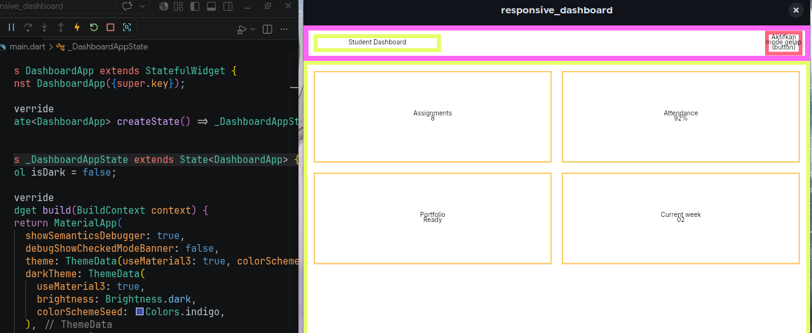

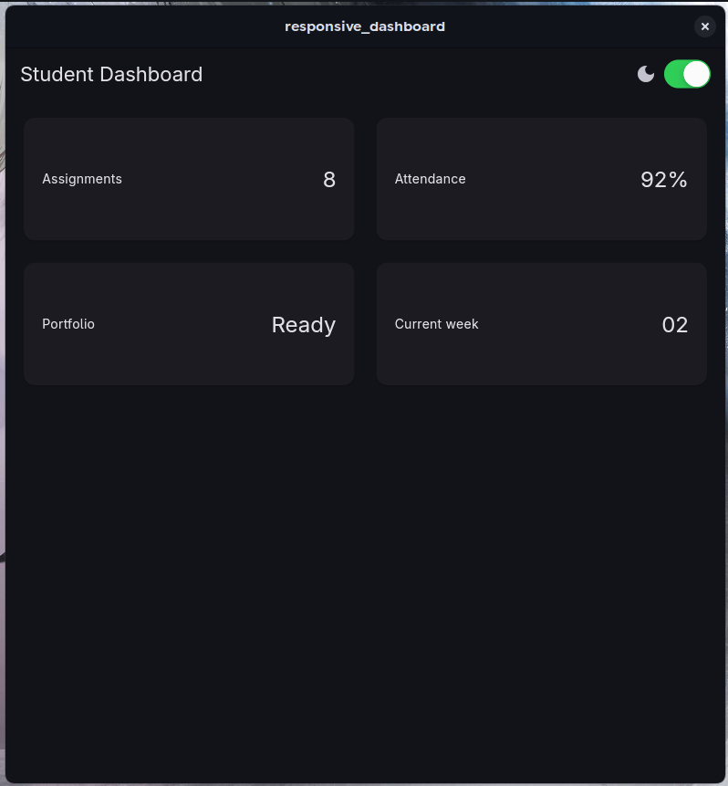

### Pilihan Desain Widget

`Material3` adalah widget dengan desain Android dan Cross-Platform, sementara `Cupertino` adalah widget dengan desain iOS. Misal perbedaan di tombol Switch dark mode

<div align="center">

| `Material3` | `Cupertino` |
| :---: | :---: |
| 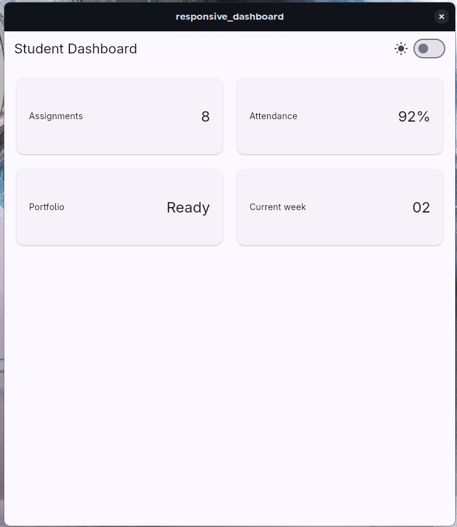 | 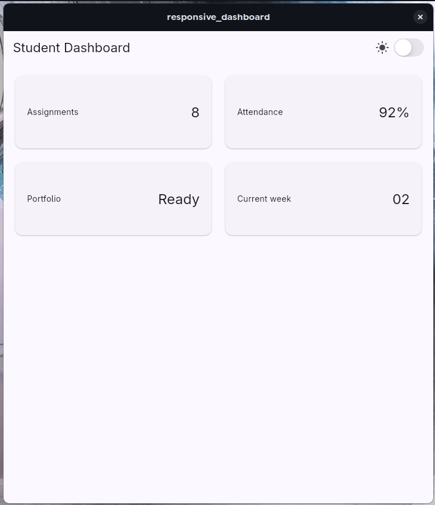 |

</div>

### Mengganti Jumlah Kolom Berdasarkan Lebar Layar

`LayoutBuilder` membaca ukuran layar, bisa digunakan untuk mengubah jumlah kolom/arah layout. kode `final columns = constraints.maxWidth >= 700 ? 2 : 1;` menentukan jumlah kolom dengan batasan tertentu (jika lebar layar >= 700px, kolomnya 2, else 1). Ini perbedaannya

<div align="center">

| Tambah Batasan (1000, lebar tapi masih 1 kolom) | Baseline (700, 1 kolom) | Kurangi Batasan (400, sempit tapi masih 2 kolom) |
| :---: | :---: | :---: |
| 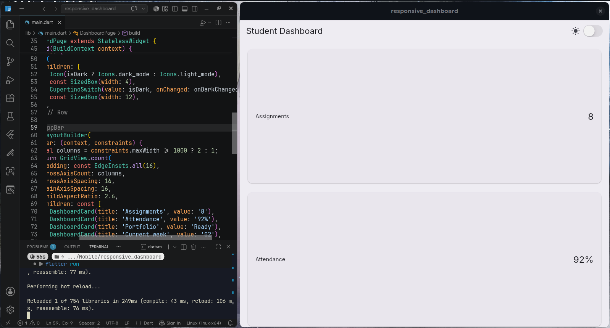 | 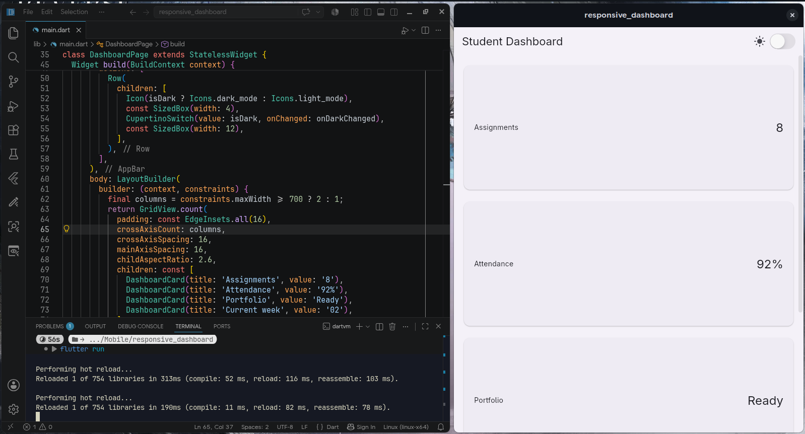 | 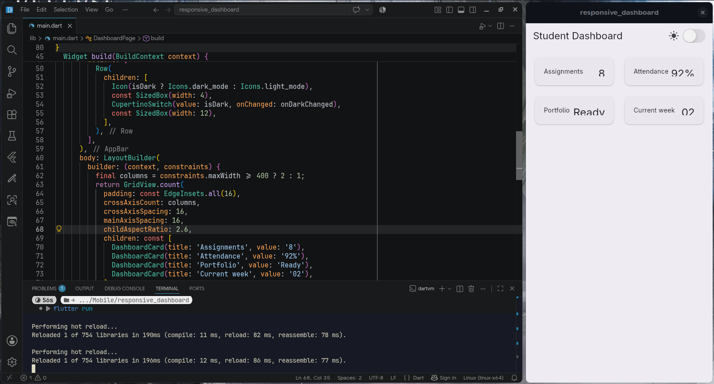 |

</div>

## AI Prompt Challenge

### 1. "Bandingkan dua tata letak dashboard akademik untuk Flutter: versi GridView dan versi LayoutBuilder + Column. Jelaskan trade-off responsif dan aksesibilitasnya."

<div align="center">

| Jawaban AI | Rekomendasi + Alasan |
| :---: | :---: |
| 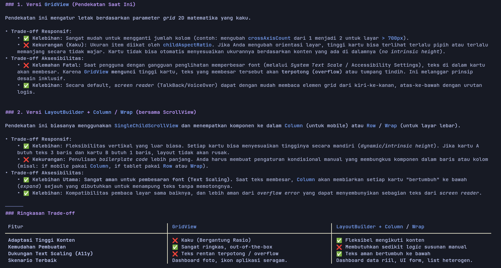 | 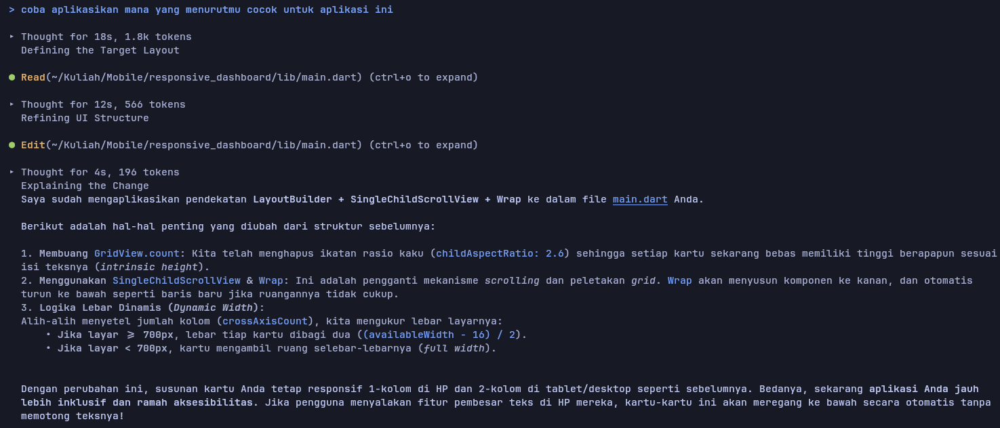 |

</div>

Jika diterapkan sesuai rekomendasi AI, hasilnya hanya berbeda di kasus ekstrim untuk layar sangat sempit

<div align="center">

| `GridView` | `LayoutBuilder` |
| :---: | :---: |
| 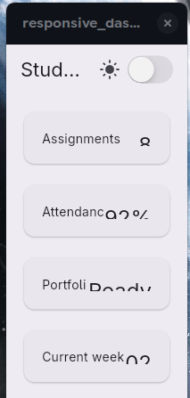 | 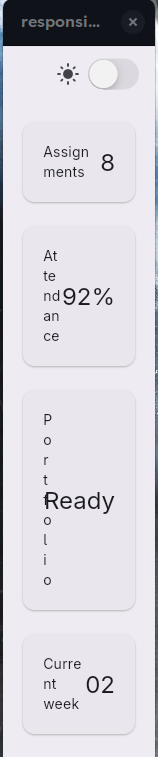 |

</div>

### 2. "Jelaskan kapan penggunaan Expanded justru menyebabkan overflow di dalam Row, beri contoh kode yang gagal dan perbaikannya."

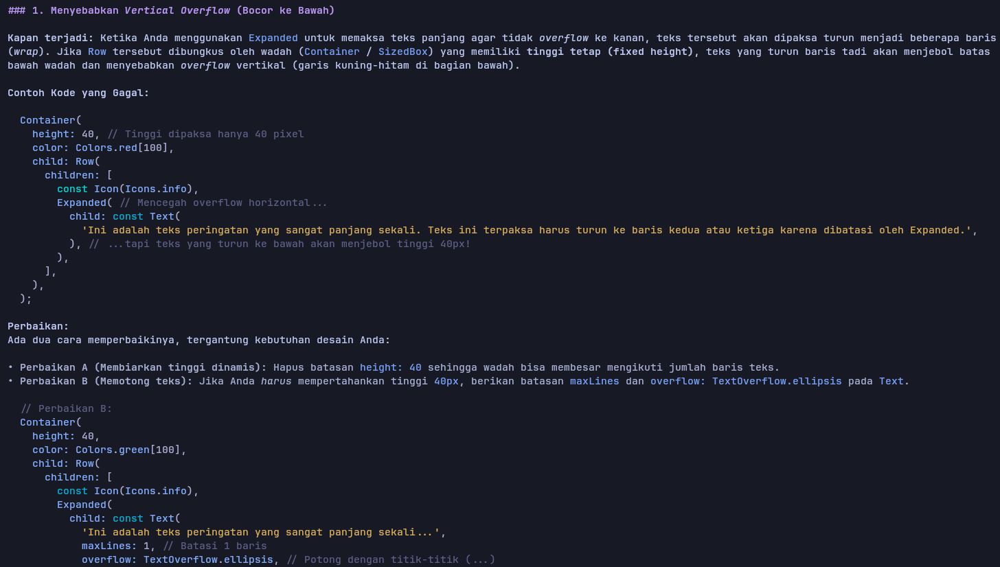
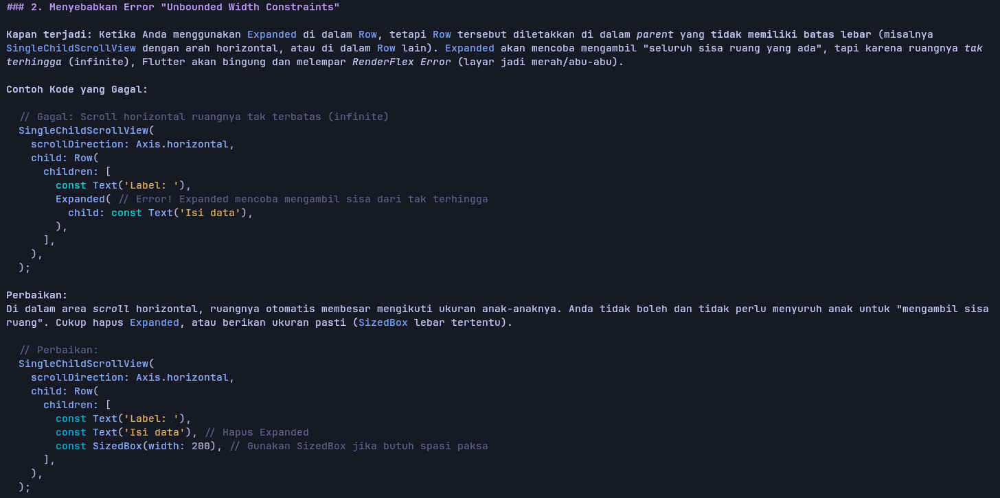

### 3. "Periksa kembali rekomendasi layout di atas: apakah tetap responsif di bawah 600px, apakah mengurangi aksesibilitas, dan apakah ada widget yang tidak tersedia di Flutter stabil saat ini?"

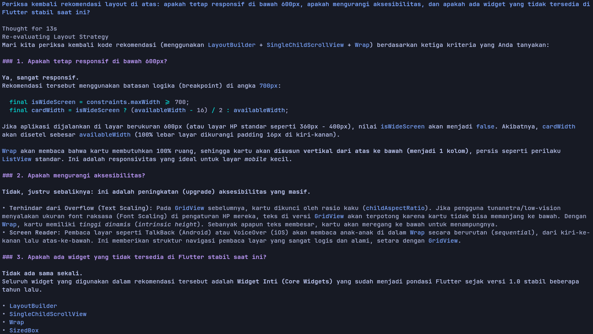

## Refactoring Challenge

### 1. Ekstrak kartu informasi menjadi widget reusable (misal InfoCard) yang menerima title dan value, sehingga tidak ada duplikasi widget.

`DashboardCard` diubah menjadi nama yang lebih generic `InfoCard` serta menambah `width` ke parameter agar tidak mendeklarasikan width tiap kartunya

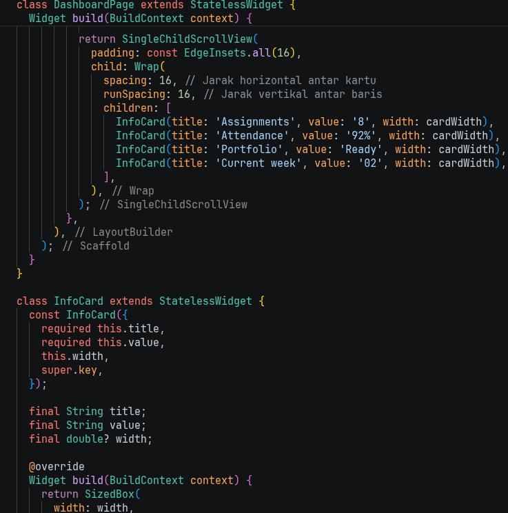

### 2. Ganti warna dan ukuran yang di-hardcode dengan Theme.of(context) agar mengikuti tema terang/gelap secara otomatis.

Menambah variabel untuk tema default agar tidak diketik berkali-kali:
```
    final theme = Theme.of(context);
    final colorScheme = theme.colorScheme;
    final textTheme = theme.textTheme;
```

Warna diganti dengan color scheme primary (indigo) dengan `colorScheme.primary` dan teks style diganti dengan `textTheme`

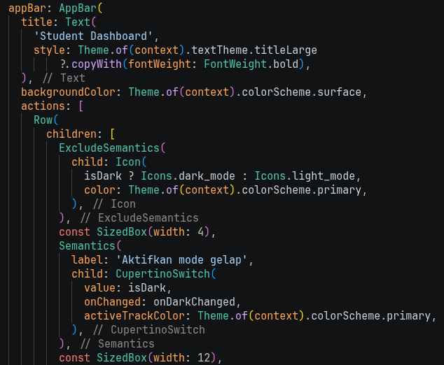
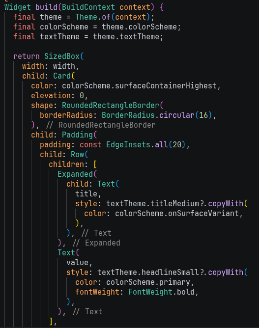

### 3. Pindahkan breakpoint ke satu konstanta bernama (misal const kWideBreakpoint = 700;) agar hanya didefinisikan satu kali.

`const double kWideBreakpoint = 700;` ditaruh di awal kode, lalu `700` diganti dengan `kWideBreakpoint`

### 4. Jalankan flutter analyze dan pastikan tidak ada error maupun warning baru.

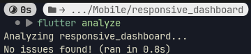

## Testing Dasar

Testing gagal karena `tester.getSize` hanya ingin menerima 1 elemen, tapi `Card` ada 4 elemen, karena itu errornya 'too many elements'

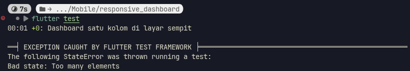

Cara memperbaikinya yaitu mengambil satu saja elemen, bisa pakai `first`

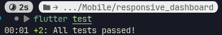

