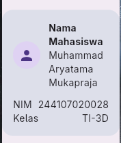
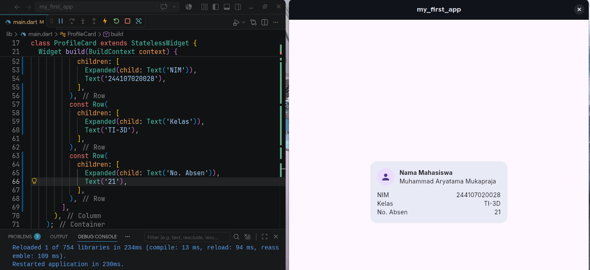
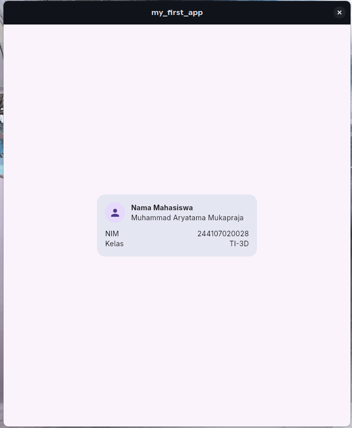
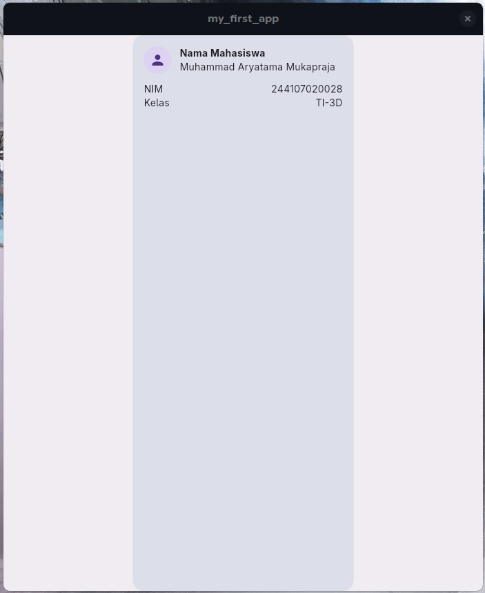

# Week 2

## Hasil yang Dicapai

### Mengetahui `Expanded` dan `mainAxisSize` untuk Layout

`Expanded` untuk responsitivitas layar, mencegah overflow jika layar dipersempit. Latihan dengan menambah baris data baru.

| Dengan `Expanded` | Tanpa `Expanded` | Tambah `No. Absen` |
| :---: | :---: | :---: |
|  |  |  |

`mainAxisSize` defaultnya adalah `max` dimana akan menjadi wrapper yang memenuhi seluruh `row` atau `column`, sebaliknya nilai `min` hanya memenuhi tempat seminimal mungkin untuk `children`

| Dengan `min` | Dengan `max` |
| :---: | :---: |
|  |  |

