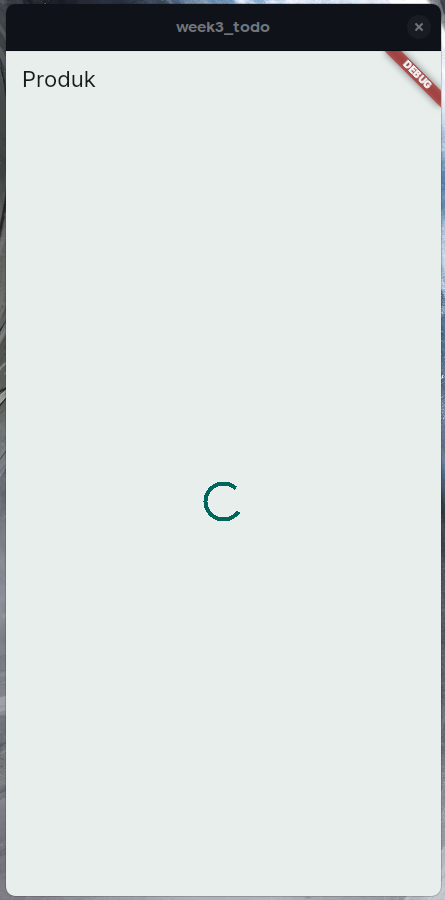
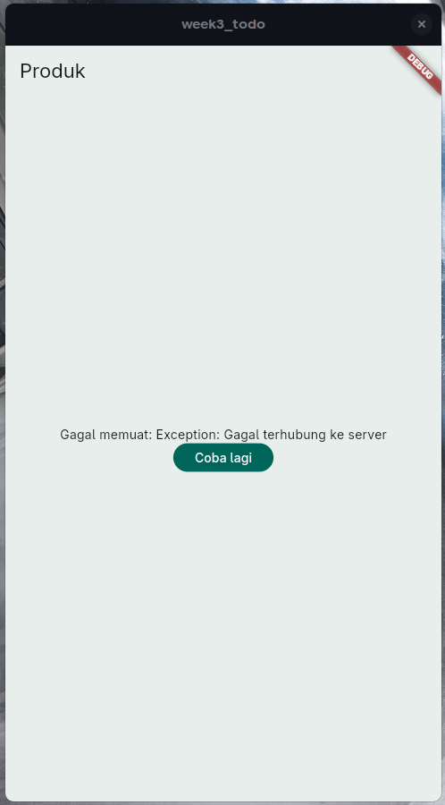
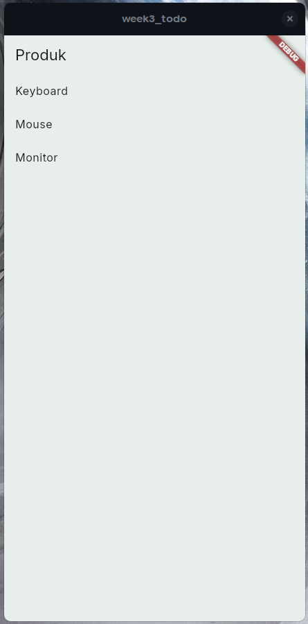
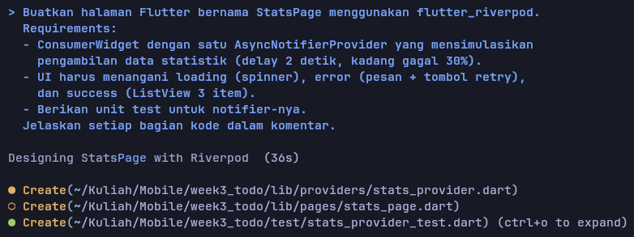
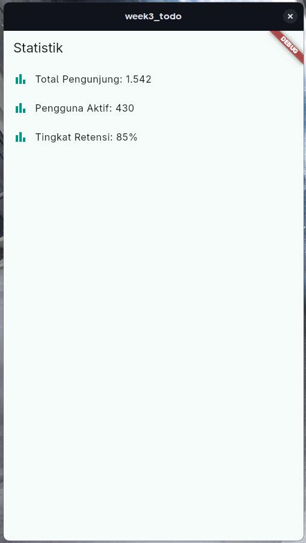
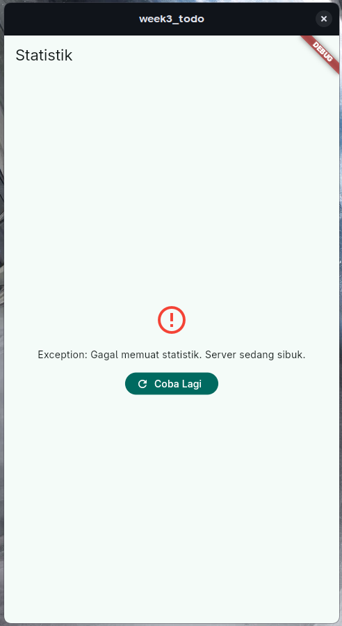
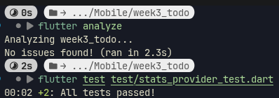
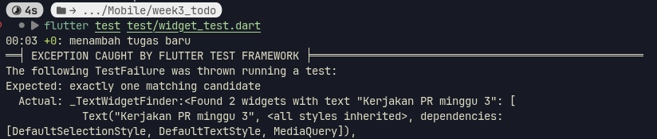

# Week 3

## Tujuan

- Menjelaskan konsep navigasi, route, dan perbedaan Navigator 1.0 dengan GoRouter
- Menerapkan navigasi multi-page dengan GoRouter, termasuk passing argument dan deep link sederhana
- Menjelaskan mengapa state management diperlukan dan cara kerja Riverpod (Provider, ConsumerWidget, Notifier)
- Menggunakan AsyncValue untuk menangani state loading, error, dan success pada UI
- Membangun aplikasi ToDo dengan navigasi dan Riverpod, lalu memverifikasi hasilnya dengan widget test sederhana

## Fitur Utama

- Navigasi Multi-page dengan GoRouter
- State Management dengan Riverpod
- AsyncValue untuk menangani state loading, error, dan success

## Hasil yang Dicapai

### Routing dengan GoRouter

| Fitur / Konsep | Navigasi Biasa (`Navigator`) | GoRouter |
| :--- | :--- | :--- |
| **Cara Kerja** |  Menginstruksikan langkah fisik untuk menumpuk (`push`) atau membuang (`pop`) halaman. | Berbasis URL. Cukup sebutkan alamat tujuannya, sistem yang mengatur pergantiannya. |                                                                                                
| **Penulisan Kode** | Panjang dan berulang: `Navigator.push(context, MaterialPageRoute(builder: (context) => Page()))` | Sangat ringkas dan bersih: `context.go('/page')` |
| **Peta Rute** | Tersebar di mana-mana. Susah mencari daftar seluruh halaman yang ada di aplikasi. | Terpusat di satu tempat (biasanya di `main.dart`). Berfungsi bak "Daftar Isi" aplikasi. |     
| **Dukungan Web & *Deep Linking*** | Sulit tersinkronisasi dengan URL bar. Sering bermasalah jika tombol *Back* di browser ditekan. | URL bar sinkron otomatis, tombol *Back* browser bekerja sempurna. Mudah membuka link dari luar (contoh: WhatsApp). |
| **Bottom Navigation (Menu Bawah)** | Rentan *error*. Pindah tab sering membuat menu bawah tertimpa halaman baru atau state-nya ter-reset. | Sangat mudah dan stabil menggunakan **`ShellRoute`**. Menu bawah akan persisten (menempel) sementara konten di tengah berganti. |
| **Proteksi Halaman (*Auth Guard*)** | Harus dicek manual satu per satu di dalam logika setiap tombol `onPressed` sebelum pindah halaman. | Otomatis memilikifitur pencegat **`redirect`**. Bisa memblokir dan melempar *user* ke `/login` jika belum masuk, di level Router.|

### Mempelajari ref di Riverpod

- `ref.watch` = Melihat data terus-menerus. Halaman yang di-watch akan langsung otomatis di-refresh, menampilkan data baru. Biasa dipakai di `build` dan Provider yang mengharuskan update konstan terhadap UI
- `ref.read` = Mengambil snapshot, membaca data hanya sekali. Biasa dipakai oleh fungsi aksi (onPressed, onTap, onChanged) guna menjalankan perintah
- `ref.listen` = Menjalankan perintah hanya saat data berubah, tapi tidak akan di-refresh layarnya. Biasa dipakai di `build` untuk pesan warning sementara
- `ref.invalidate` / `ref.refresh` = Seperti tombol refresh, memaksa mengambil ulang data dari awal 

### Implementasi ConsumerWidget

`ConsumerWidget` adalah versi upgrade dari `StatelessWidget`, bedanya Consumer bisa menerima parameter `ref`, membuatnya bisa memakai Riverpod. Bisa juga dibandingkan dengan `StatefulWidget` yang adalah cara bawaan Flutter, `ConsumerWidget` dengan `Provider` adalah cara Riverpod yang statenya otomatis, dibanding Stateful yang harus manual dengan `setState`.

### Bisa Mengatur Loading, Error, dan Success dengan AsyncValue

Jika terdapat perubahan data yang tidak instan (await, future, dll) dan rawan error, maka memakai `AsyncNotifierProvider` yang bisa mengatur state loading, error, dan success.

<div align="center">

| Loading | Error | Data (Success) |
| :---: | :---: | :---: |
|  |  |  |

</div>

## AI Challenge

Berikut prompt yang digunakan serta hasil awal AI:



`providers/stats_provider.dart` dan `pages/stats_page.dart` tidak ada perubahan, bisa dilihat di git folder `week3_todo`, yang akan ada perbedaan adalah `test/stats_provider_test.dart`:

```
import 'dart:math';
import 'package:flutter_test/flutter_test.dart';
import 'package:flutter_riverpod/flutter_riverpod.dart';

// Gunakan relative path agar langsung merujuk ke file aslinya
import '../lib/providers/stats_provider.dart';

// --- MOCK OBJECTS ---
// Kita membuat versi palsu dari Random() untuk mengontrol 30% peluang di Unit Test

// 1. Mock ini selalu memunculkan angka 0.5 (di atas 0.3) agar selalu Sukses
class MockRandomSuccess extends Random {
  @override
  double nextDouble() => 0.5; 
}

// 2. Mock ini selalu memunculkan angka 0.1 (di bawah 0.3) agar selalu Gagal
class MockRandomFail extends Random {
  @override
  double nextDouble() => 0.1; 
}

void main() {
  group('StatsNotifier Tests', () {
    test('Berhasil memuat 3 data statistik (Skenario Sukses)', () async {
      // 1. Buat kontainer Riverpod untuk testing dan Override randomProvider
      final container = ProviderContainer(
        overrides: [
          // Paksa Riverpod menggunakan Mock yang dijamin sukses
          randomProvider.overrideWithValue(MockRandomSuccess()),
        ],
      );
      // Hapus container jika tes sudah selesai
      addTearDown(container.dispose);

      // 2. Cek apakah status awal saat provider pertama dibaca adalah "Loading"
      expect(
        container.read(statsProvider),
        const AsyncValue<List<String>>.loading(),
      );

      // 3. Tunggu Future() dari build() selesai beroperasi
      final result = await container.read(statsProvider.future);

      // 4. Verifikasi (Assert)
      // Harus berupa Array(List) string
      expect(result, isA<List<String>>());
      // Jumlah item harus 3 buah
      expect(result.length, 3);
      // Status terakhir provider harus tidak memiliki error
      expect(container.read(statsProvider).hasError, false);
    });

    test('Memunculkan exception saat server sibuk (Skenario Gagal 30%)', () async {
      final container = ProviderContainer(
        overrides: [
          // Paksa Riverpod menggunakan Mock yang dijamin di bawah 0.3
          randomProvider.overrideWithValue(MockRandomFail()),
        ],
      );
      addTearDown(container.dispose);

      // Pastikan status awal adalah loading
      expect(
        container.read(statsProvider),
        const AsyncValue<List<String>>.loading(),
      );

      // Karena kita tahu tes ini akan melempar Exception, kita membungkusnya 
      // dengan expectLater dan mendeteksi adanya error (throwsA)
      await expectLater(
        container.read(statsProvider.future),
        throwsA(isA<Exception>()),
      );

      // Status terakhir dari provider pastilah memiliki error
      expect(container.read(statsProvider).hasError, true);
    });
  });
}
```

## Hasil

<div align="center">

| Skenario Berhasil (70%) | Skenario Gagal (30%) |
| :---: | :---: |
|  |  |

</div>

### Apakah state diubah secara immutable (tidak ada state.add() atau mutasi list langsung)?

Tidak ada mutasi list langsung. Di `StatsNotifier`, ketika proses memuat data di `build()` berhasil, maka akan return list baru `['Total Pengunjung: 1.542',...]` yang menimpa state lama akibat `AsyncNotifier`, lalu `ref.watch` di `StatsPage` mendeteksi perubahan untuk merender ulang UI

### Apakah ref.watch hanya dipakai di dalam build, dan ref.read di callback?

`final statsAsync = ref.watch(statsProvider);` hanya dipakai di build dan tidak ada `ref.read`, tapi ada `ref.invalidate` untuk aksi satu kali di dalam callback `onPressed`

### Apakah ketiga state AsyncValue benar-benar ditangani (bukan hanya success)?

Ketiga state ditangani karena memakai `.when()`, yaitu `loading: ()` saat loading/data diproses, `error: (error, stackTrace)` saat gagal memuat data, dan `data: (stats)` saat data berhasil didapat/ditampilkan

### Apakah provider dideklarasikan dengan tipe eksplisit dan tidak duplikat dengan provider lain?

Provider dideklarasikan dengan `final statsProvider = AsyncNotifierProvider<StatsNotifier, List<String>>(StatsNotifier.new);` sehingga tidak duplikat dengan provider lain

### Apakah kode AI memakai API Riverpod versi lama (StateProvider antipattern, StateNotifierProvider usang, atau Consumer bertingkat yang tidak perlu)? Perbaiki ke pola Notifier/ConsumerWidget.

Tidak, API Riverpodnya sudah versi terbaru dengan memeakai `AsyncNotifier` dan `AsyncNotifierProvider` serta terbebas dari Consumer bertingkat karena sudah pakai `ConsumerWidget` di kode `class StatsPage extends ConsumerWidget { ...`

### Jalankan flutter analyze dan flutter test, apakah hasil AI lolos tanpa warning?

Test gagal karena kesalahan import relative path dan tidak override method saat memakai `Random` di dart. Setelah banyak kasus gagal dan memperbaikinya, akhirnya tes berhasil (file akhir di `week3_todo/test/stats_provider_test.dart`)



## Testing

Saat dijalankan terdapat error: 



Hal ini terjadi karena "Kerjakan PR minggu 3" muncul di 2 tempat: Tulisan di daftar (benar) dan di TextField pop-up saat menambah tugas (salah). Pop-up ini masih terdeteksi karena memakai `await.tester pump` yang mengambil 1 frame setelah aksi sebelumnya, sedangkan pop-up itu hanya hilang setelah ~300ms, membuatnya terdeteksi juga. Solusinya adalah menggunakan `await.tester pumpAndSettle` yang membuat tester menunggu sampai seluruh animasi selesai, membuat tester menemukan hanya 1 widget sesuai yang diinginkan