# Week 4

## Tujuan

- Menjelaskan konsep HTTP, REST API, dan JSON
- Memetakan JSON ke model Dart (serialization) dengan aman null
- Menerapkan repository pattern dasar sehingga UI tidak memanggil API secara langsung
- Mengonfigurasi Dio (base URL, timeout, interceptor) dan menangani error jaringan
- Menampilkan state loading, error, empty, dan success pada UI dengan AsyncValue + Riverpod
- Menerapkan pagination dasar (infinite scroll)

## Fitur Utama

- Manajemen Jaringan & HTTP (Dio) Terpusat 
- Skalabilitas Pagination & UI Fleksibel

## Hasil yang Dicapai

### Implementasi Dio untuk HTTP Client

dio adalah library HTTP yang sangat populer di Flutter, menawarkan fungsionalitas yang jauh lebih luas dibandingkan package http. Ia dirancang untuk memberikan fleksibilitas dan kontrol yang lebih besar kepada developer.

Kelebihan Package dio:
- Interceptor: Fitur unggulan yang memungkinkan Anda mengintersep request dan response untuk melakukan logging, autentikasi, modifikasi data, dan banyak lagi sebelum atau sesudah request dikirim/diterima.
- Penanganan Error yang Canggih: Menyediakan penanganan error yang lebih terstruktur dan dapat dikustomisasi.

<div>

| Success Loading | Error (No Internet dan Salah URL)  | Error (No URL) |
| :---: | :---: | :---: |
| 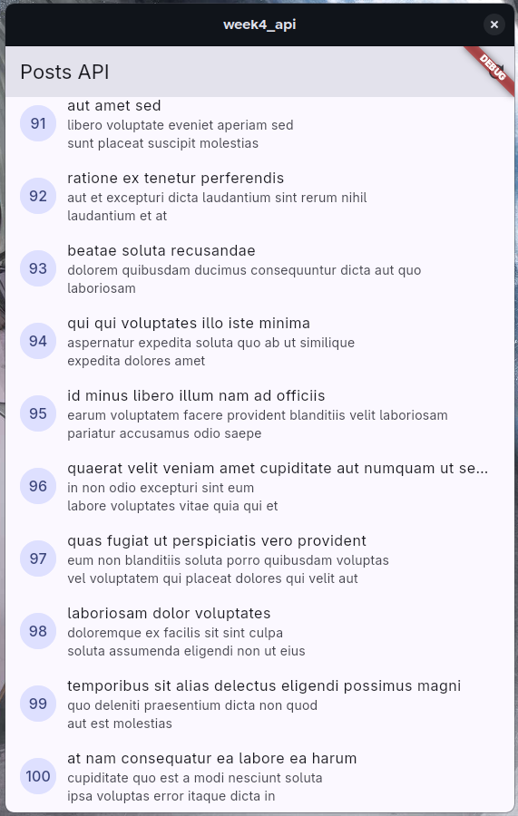 | 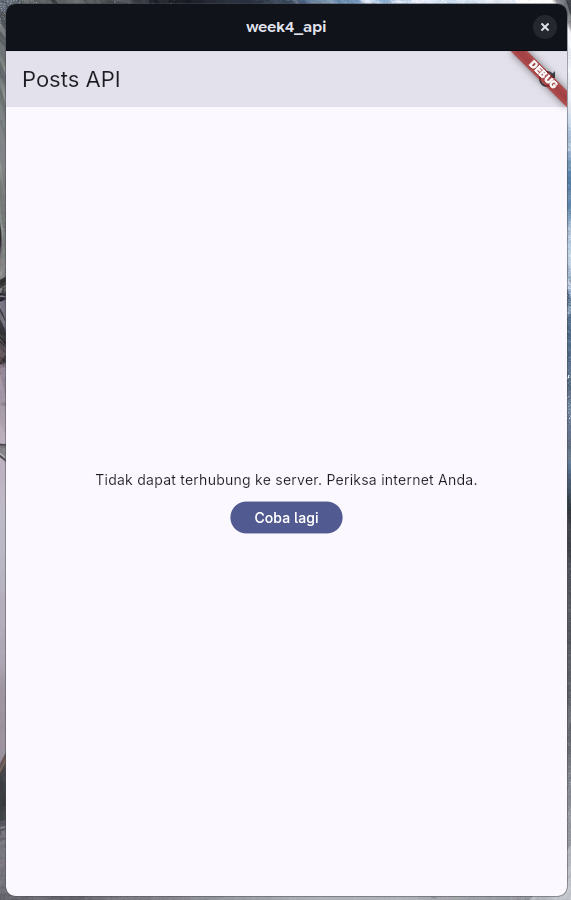 | 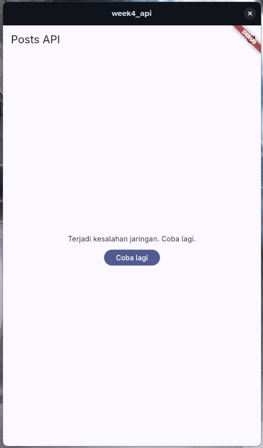 |

</div>

- Transformasi Data Otomatis: Memiliki dukungan bawaan untuk mengubah JSON menjadi objek Dart (dan sebaliknya) dengan mudah, seringkali menggunakan fungsi `fromJson` dan `toJson`.
- Pembatalan Request (Cancellation): Memungkinkan Anda membatalkan permintaan yang sedang berlangsung, sangat berguna untuk mencegah pembaruan data yang tidak perlu atau menghemat sumber daya.
- Manajemen Timeout: Konfigurasi timeout yang lebih fleksibel.
- Dukungan untuk Multiple Request: Memudahkan pengiriman beberapa permintaan secara bersamaan.
- Progres Upload/Download: Menyediakan callback untuk memantau progres upload dan download file.

### Pagination dan UI Infinite Scroll

Pagination adalah memecah halaman menjadi beberapa bagian, dan Infinite Scroll adalah teknik dimana dalam satu halaman isinya akan terus menerus menambah sampai data habis atau batasan lainnya.

<div align="center">

| State Awal | Bentuk Pagination |
| :---: | :---: |
| 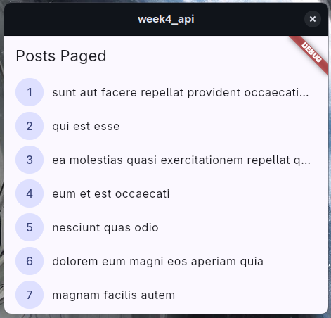 | 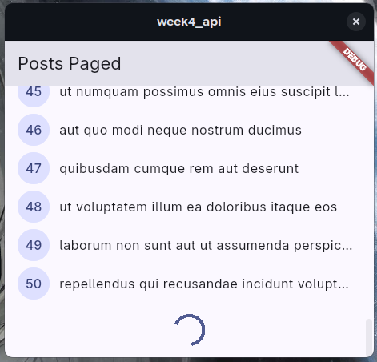 |
| Hasil Pagination | Akhir Infinite Scroll|
| 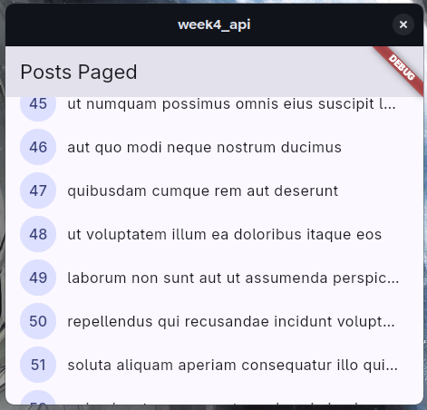 | 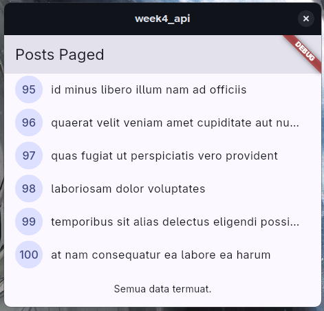 |

</div>

## AI Challenge

Berikut prompt yang digunakan serta hasil awal AI:

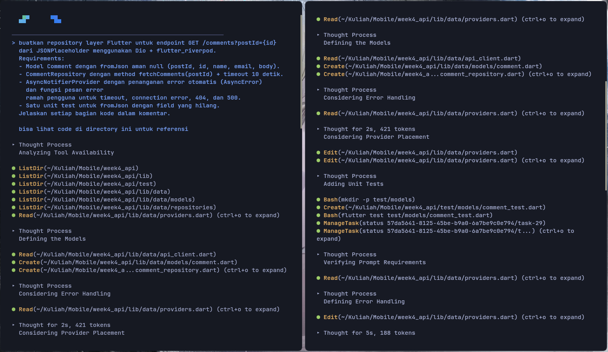

## Hasil

### Apakah UI memanggil Dio secara langsung (dilarang) atau lewat repository?

UI memanggil Dio di repository sesuai kode:

```
// Dependency untuk repository
final commentRepositoryProvider = Provider<CommentRepository>(
  (ref) => CommentRepository(ref.watch(dioProvider)),
);

class CommentListNotifier extends AsyncNotifier<List<Comment>> {
  final int postId;
  CommentListNotifier(this.postId);

  @override
  Future<List<Comment>> build() async {
    // Notifier untuk UI hanya memanggil repository, bukan Dio
    final repository = ref.watch(commentRepositoryProvider);
    return repository.fetchComments(postId);
  }
  ...
```

### Apakah fromJson aman null, atau masih memakai cast langsung yang bisa crash?

Kode tidak menggunakan casting langsung seperti `as int`, tapi pakai nullable case `as int?` dan memberi fallback dengan operator `??`:

```
factory Comment.fromJson(Map<String, dynamic> json) {
    return Comment(
      postId: json['postId'] as int? ?? 0,
      id: json['id'] as int? ?? 0,
      name: json['name'] as String? ?? 'No Name',
      email: json['email'] as String? ?? 'No Email',
      body: json['body'] as String? ?? 'No Body',
    );
}
```

### Apakah semua tipe DioExceptionType (timeout, connectionError, badResponse) dipetakan ke pesan pengguna?

Semua error tertangkap oleh `friendlyErrorMessage` dan dipetakan berdasarkan tipe errornya:

```
String friendlyErrorMessage(Object error) {
  if (error is DioException) {
    switch (error.type) {
      case DioExceptionType.connectionTimeout:
      case DioExceptionType.sendTimeout:
      case DioExceptionType.receiveTimeout:
        return 'Koneksi lambat atau timeout. Periksa internet Anda lalu coba lagi.';
      case DioExceptionType.connectionError:
        return 'Tidak dapat terhubung ke server. Periksa internet Anda.';
      case DioExceptionType.badResponse:
        final code = error.response?.statusCode;
        if (code == 404) return 'Data tidak ditemukan (404).';
        if (code == 401 || code == 403) {
          return 'Akses ditolak ($code). Periksa kredensial Anda.';
        }
        return 'Server bermasalah ($code). Coba lagi nanti.';
      default:
        return 'Terjadi kesalahan jaringan. Coba lagi.';
    }
  }
  return 'Terjadi kesalahan tak terduga: $error';
}
```

### Apakah baseUrl/timeout terpusat di satu client, bukan tersebar di tiap method?

`baseUrl` dan timeout ada di file konfigurasi client saja:

```
Dio createDio() {
  final dio = Dio(
    BaseOptions(
      baseUrl: 'https://jsonplaceholder.typicode.com',
      connectTimeout: const Duration(seconds: 10),
      receiveTimeout: const Duration(seconds: 10),
      headers: {'Accept': 'application/json'},
    ),
   );
   ...
```

### Apakah test AI benar-benar menguji kasus field hilang, atau hanya happy path? Tambahkan minimal 1 edge case sendiri.

Ya, AI memberikan kasus field hilang. Edge case tambahan adalah jika field secara eksplisit berisi null. Hasilnya semua masuk ke fallback state masing-masing field

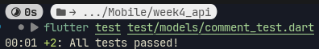

### Jalankan flutter analyze dan flutter test, apakah hasil AI lolos tanpa warning?

Ya, lolos analyze dan test

## Refactoring

### Ekstrak widget baris post menjadi PostTile tersendiri agar ListView.builder pendek dan mudah diuji.

Widget sudah dipisah ke `lib/widgets/post_tile.dart` dan halaman sudah diupdate dengan memakai `PostTile`

### Pindahkan friendlyErrorMessage ke file lib/data/network_errors.dart agar bisa dipakai ulang halaman paged dan non-paged.

`friendlyErrorMessage` sudah ditaruh ke `lib/data/network_errors.dart` dan sudah diupdate ke halaman yang membutuhkan

### Tambahkan halaman detail post dengan GoRouter (/post/:id) yang menampilkan title dan body lengkap, state detail diambil dari list yang sudah dimuat atau via repository bila langsung dibuka.

Dependency `GoRouter` sudah dipasang. `main.dart` sudah mengimplementasikan routernya. Halaman baru untuk detail post ditambahkan di `lib/pages/post_detail_page.dart` yang membaca provider baru `singlePostProvider(id)`. Provider ini akan pertama kali mencari ID post di cache memori Riverpod (di `postListProvider` atau `pagedPostsProvider`). Jika ketemu, proses loading instant. Jika refresh paksa atau masuk langsung lewat link, maka ia akan memanggil API via repository. Menambahkan fungsi `fetchPost(id)` di dalam `PostRepository` untuk menembak endpoint `HTTP GET` tunggal `(/posts/$id)`. Memperbarui `PostTile` yang jika di-tap, langsung melakukan `push('/post/${post.id}')` dengan `GoRouter`.

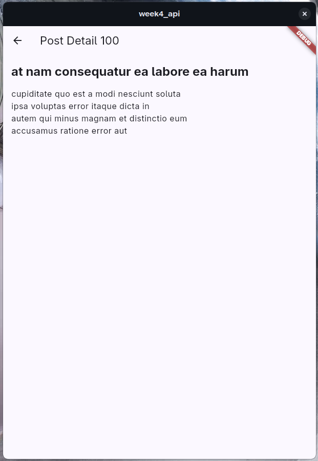

## Testing

Testing berjalan dengan lancar

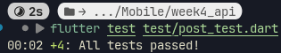
