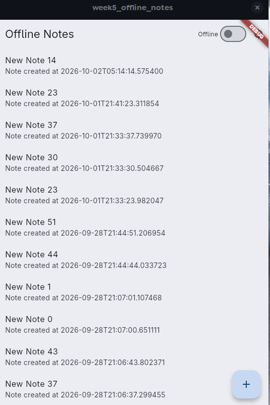
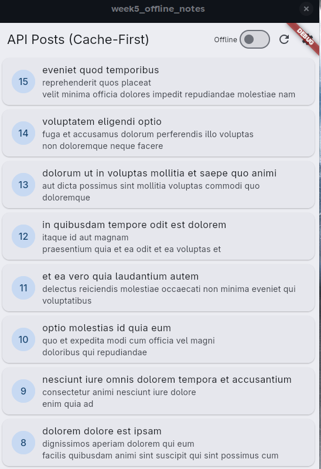
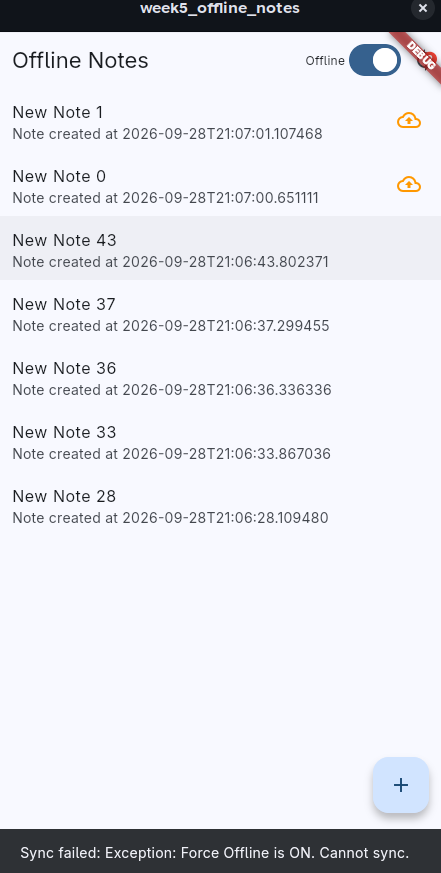
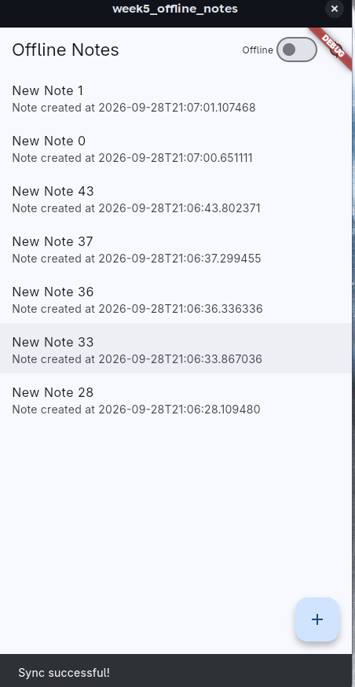
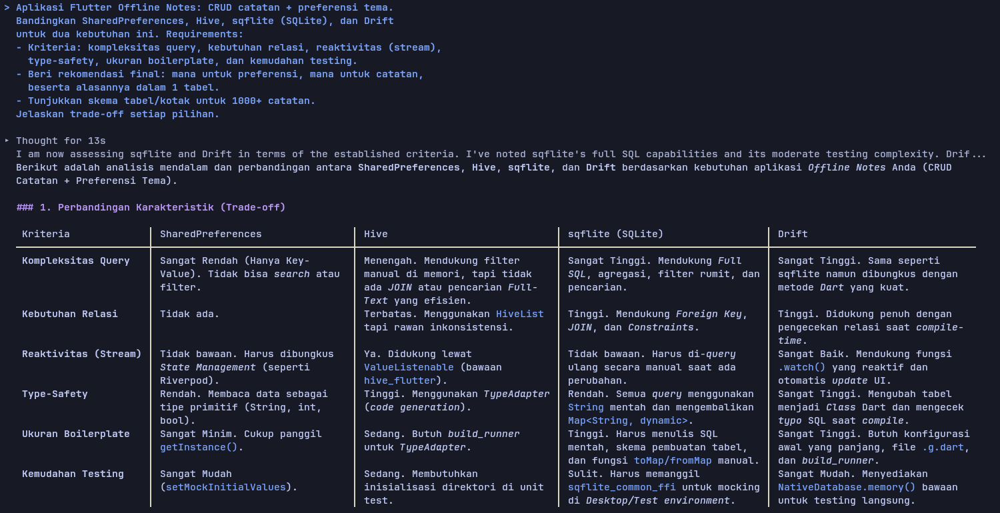
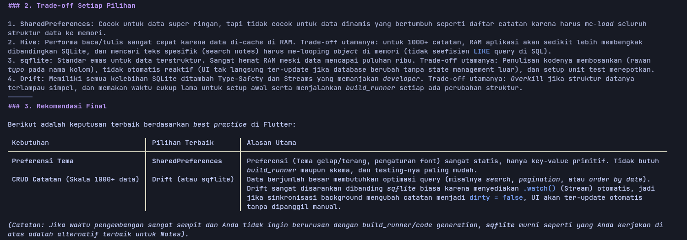
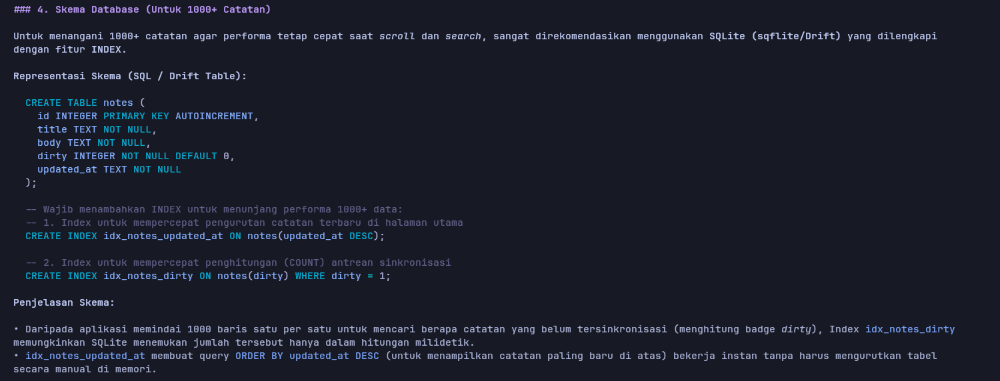
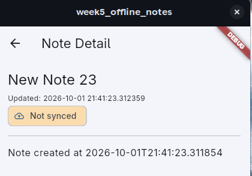
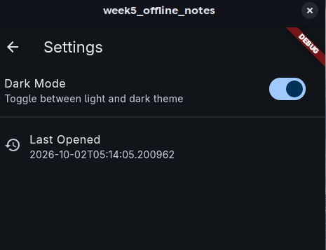

# Week 5

## Tujuan

- Menjelaskan perbedaan penyimpanan key-value, relasional, dan NoSQL di perangkat
- Menyimpan preferensi sederhana (tema, terakhir dibuka) dengan SharedPreferences
- Menerapkan CRUD catatan dengan SQLite (sqflite) melalui repository lokal
- Menerapkan pola offline-first: cache-first read, dirty flag, dan antrean sinkronisasi
- Menampilkan state loading, error, empty, dan success untuk data lokal dengan Riverpod
- Menguji repository lokal dengan repository palsu (tanpa database sungguhan).

## Fitur Utama

- Aplikasi catatan offline-first dengan CRUD lokal (SQLite)
- Cache-first posts dari API
- Dirty flag + sync simulation
- Dark mode
- Navigasi GoRouter

## Hasil yang Dicapai

### Arsitektur offline-first (local-first vs cache-first)

| Perbedaan | Local-first (Notes) | Cache-first (Posts) |
| :---: | :---: | :---: |
| Data Utama | Selalu ada di lokal | Ada di server, lokal hanya salinan |
| Offline | Tetap bisa baca/tulis | Hanya bisa baca cache lama |
| Sync direction | Upload (push) | Download (pull) |
| Konflik | Perlu dirty flag + aturan konflik | Tidak ada (read-only) |
| Implementasi | SQLite sebagai source of truth | Cache dulu, background refresh |

Pada notes, mau offline atau tidak, tetap bisa membaca data note yang ada dan bisa menambah note karena datanya disimpan secara lokal. Pada posts, jika offline hanya menampilkan data yang sudah diambil, jika ada data baru harus online karena databasenya di luar dan harus ada akses internet

<div align='center'>

| Notes | Posts |
| :---: | :---: |
|  |  |

</div>

### Sinkronisasi data asinkron dengan dirty tracking

Sebagai simulasi, ada fitur sinkronisasi data. Sinkronisasi biasanya terhubung untuk menyimpan data salinan ke tempat lain. Data baru akan ditandai "dirty" yang artinya belum tersinkron, dan data yang sudah tersinkron akan hilang tandanya

<div align='center'>

| Dirty (Belum Sinkron) | Not Dirty (Sudah Sinkron) |
| :---: | :---: |
|  |  |

</div>

## AI Challenge

Berikut prompt yang digunakan serta hasil awal AI:





### Apakah AI menempatkan daftar catatan di SharedPreferences? (menolak: rapuh untuk koleksi).

Tidak, daftar catatan ditaruh di Drift/sqflite. SharedPreferences untuk data ringan yang tidak bertumbuh (seperti preferensi tema gelap/terang dan ukuran font)

### Apakah skema AI mendukung antrean sync (dirty flag / updated_at) atau hanya CRUD polos?

Ya, mendukung karena ada kolom dirty dan updated_at

### Apakah klaim "real-time" AI didukung stream (Drift/watch) atau hanya asumsi?

Ya, didukung stream fitur asli, bukan asumsi. Ada fitur dari Drift yaitu `.watch()` yang bereaksi terhadap event perubahan baris di SQLite.

### Apakah estimasi boilerplate AI masuk akal setelah Anda mencoba instalasinya (flutter pub add + migrasi skema)?

Ya, masuk akal. Untuk menginstal Drift, butuh `flutter pub add drift`, `build_runner` dan `drift_dev`, membuat file kelas Tabel khusus, menjalankan perintah terminal untuk code generation (`.g.dart`), dan buat fungsi migrasi skema (seperti `onUpgrade`)

### Keputusan final Anda beserta alasannya, boleh berbeda dari rekomendasi AI selama berargumen.

Setuju dengan hasil AI, masuk akal dan memenuhi ceklis verifikasi yang diberikan

## Refactoring

### Ekstrak baris catatan menjadi widget NoteTile tersendiri yang menampilkan badge "belum tersinkron" bila dirty == true.

Widget dibuat di `lib/widgets/note_tile.dart` untuk mengganti ListTile di `lib/pages/notes_page.dart`

```
        data: (notes) {
          if (notes.isEmpty) {
            return const Center(child: Text('No notes yet.'));
          }
          return ListView.builder(
            itemCount: notes.length,
            itemBuilder: (context, index) {
              final note = notes[index];
              return NoteTile(
                note: note,
                onTap: () {
                  // TODO: implement note editing
                },
                onLongPress: () async {
                  if (note.id != null) {
                    await ref.read(noteRepositoryProvider).deleteNote(note.id!);
                    ref.invalidate(notesProvider);
                    ref.invalidate(dirtyCountProvider);
                  }
                },
              );
            },
          );
```

### Pindahkan logika cache posts dan syncNotes ke file lib/data/sync.dart agar repository tetap fokus pada CRUD.

`lib/data/sync.dart` berisi SyncService (syncNotes) + PostsSyncService (cache-first posts) + postsProvider, `lib/data/repositories/post_repository.dart` berisi hanya CRUD readCachePosts() + replaceCachedPosts

### Tambahkan halaman detail catatan dengan GoRouter (/note/:id) yang membaca dari repository lokal, bukan dari state halaman list.

`lib/router.dart` berisi konfigurasi navigasi GoRouter, `lib/pages/note_detail_page.dart` berupa halaman detail note dengan `noteDetailProvider` yang mengambil dari repository (`NoteRepository.getNote(id)`), dan penyesuaian file lain akibat implementasi GoRouter dan halaman detail



## Testing

Test di praktikum tidak lolos test, solusi:
- Menambah import `notes_page.dart` agar `notesProvider` bisa diakses
- `fetchNotes()` diubah dari throw synchronous → `Future.error()` async
- `testNotesProvider` (non-autoDispose) ditambahkan sebagai provider khusus test
- Test error diubah, `container.listen` + cek `.error` langsung, bukan `isA<AsyncError>()`

Fungsi Test:
- fromMap aman terhadap field yang hilang: Memastikan `Note.fromMap()` tidak crash saat field `body`, `updated_at`, atau `dirty` tidak ada di map, default value harus dipakai
- flag dirty bertahan pada serialisasi: Memastikan `Note → Map → Note` (round-trip) tetap mempertahankan status dirty
- provider sukses dengan repository palsu: Memastikan `notesProvider` (autoDispose) dengan benar mengambil data dari repository dan mengembalikan `List<Note>`
- provider error dengan repository palsu: Memastikan `testNotesProvider` (non-autoDispose) dengan benar menangkap error dari repository `via .error`

## Mini project / Industry Challenge

- Toggle tema gelap/terang + waktu terakhir dibuka via SharedPreferences diimplementasi di halaman setting
- Aturan konflik eksplisit didokumentasikan di `sync.dart`


