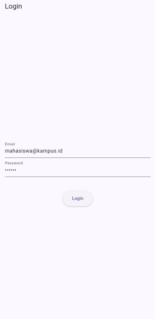
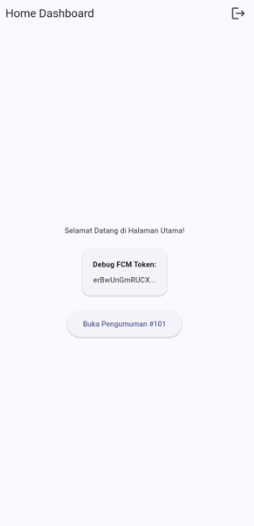
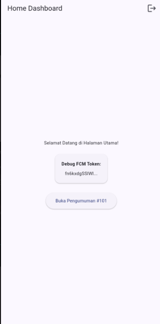
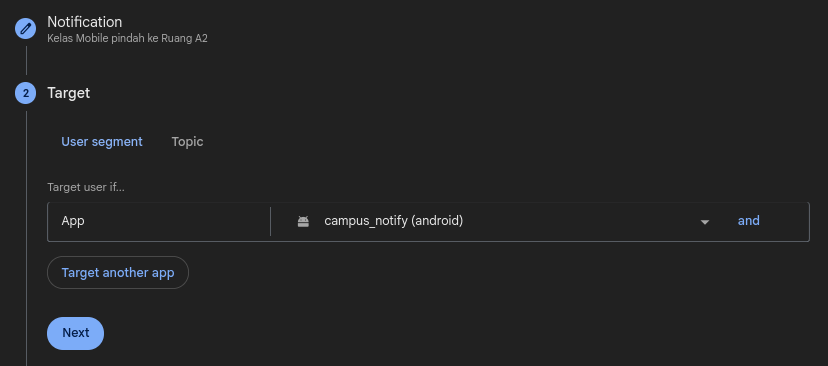
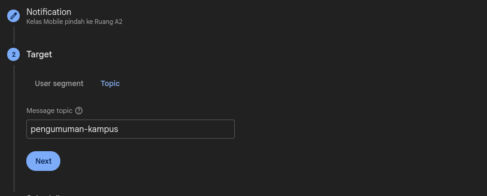
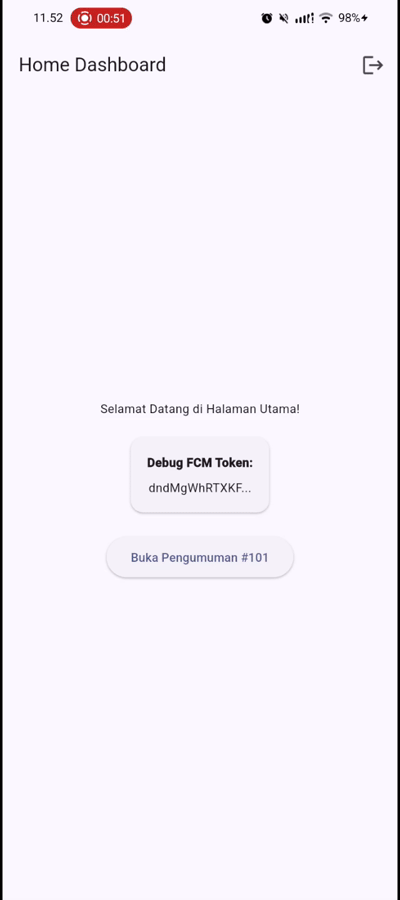
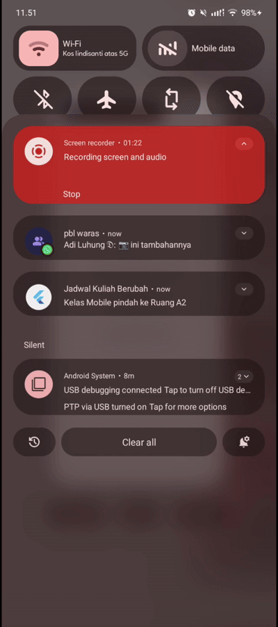
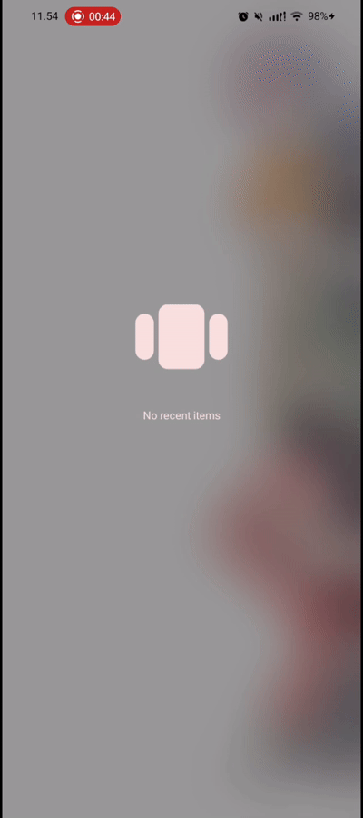
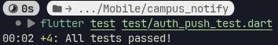

# Week 6

## Tujuan

- Menjelaskan alur autentikasi (Firebase Auth / JWT / OAuth / Google Login) dan perbedaan ID token vs access token vs refresh token
- Menyimpan token secara aman dengan secure storage serta menerapkan token refresh otomatis
- Menjelaskan arsitektur FCM: app server, Firebase, dan perangkat
- Meminta notification permission dan mengelola token lifecycle (getToken, onTokenRefresh)
- Membedakan notification payload vs data payload serta perilakunya pada state foreground, background, dan terminated
- Menangani klik notifikasi (deep link dengan GoRouter) dan topic messaging
- Menerapkan prinsip keamanan dasar aplikasi mobile (tidak menyimpan secret di kode, tidak log token)

## Fitur Utama

- Notifikasi Real-Time Multi-State
- Navigasi Deep Linking Otomatis
- Penyiaran Pengumuman Masal (Topic Subscription)
- Notifikasi Personal Spesifik
- Sistem Registrasi Perangkat Otomatis
- Manajemen Akses & Rute Terproteksi
- User Friendly Error Message

## Hasil yang Dicapai

### Autentikasi & Token

Mengadakan halaman login untuk autentikasi dan token sebagai identitas.

| Login Page | Token (tampil sebagian) | Token setelah hapus data |
| :---: | :---: | :---: |
|  |  |  |

### Menggunakan Firebase

Firebase adalah platform pengembangan aplikasi mobile dan web berbasis Backend-as-a-Service (BaaS) yang dikembangkan oleh Google. Platform ini memungkinkan pengembang membuat, mengelola, dan mengembangkan aplikasi (Android, iOS, web) tanpa harus repot mengatur infrastruktur backend atau server secara manual.

Fitur dan Layanan Utama Firebase
- Authentication: Membantu mengelola sistem login pengguna (melalui email, Google, Facebook, nomor telepon, dll.) dengan mudah dan aman.
- Realtime Database & Cloud Firestore: Basis data NoSQL untuk menyimpan dan menyinkronkan data secara real-time ke semua perangkat yang terhubung.
- Cloud Storage: Tempat penyimpanan file seperti gambar, video, dan audio yang dibuat oleh pengguna.
- Cloud Messaging (FCM): Alat untuk mengirim push notification ke aplikasi seluler atau web

Di topik FCM, bisa memilih antara mengirim ke semua (broadcast) dan spesifik (per device atau yang subscribe topic) via Firebase Console

<div align="center">

| Broadcast | Topic |
| :---: | :---: | 
|  |  | 

</div>

## AI Challenge

Berikut hasil verifikasi AI tentang projek yang dibuat:

```
Stack Teknologi yang Diminta:

✅ firebase_messaging & flutter_local_notifications: Sudah terintegrasi penuh untuk menangani pesan FCM dan banner lokal.

✅ go_router & Riverpod: Sudah berjalan harmonis. Logika navigasi dinamis yang baru saja kita perbaiki membuktikan Riverpod (ref.read) dan go_router (push/go) sudah saling tersinkronisasi.

✅ flutter_secure_storage: Sesuai konteks awal Anda, manajemen token (TokenStore & AuthRepository) telah menangani sisi keamanan sesi aplikasi.

Fitur PushService:

✅ onMessage (tampilkan local notification manual): Selesai. Fungsi listenForeground berhasil menangkap pesan dan menampilkannya melalui banner _local.show().

✅ onMessageOpenedApp + getInitialMessage: Selesai. Keduanya sudah terhubung dengan navigasi rute dinamis (mengekstrak data['route']) di listenForeground dan handleTerminated.

✅ subscribe/unsubscribe topic: Selesai. Fungsi subscribeToCampusTopic() dan unsubscribeFromCampusTopic() yang menargetkan topik pengumuman-kampus sudah tersedia dan dipanggil otomatis saat inisialisasi token.

✅ Background handler top-level: Selesai. Fungsi firebaseMessagingBackgroundHandler sudah diletakkan di luar kelas dengan dekorator wajib @pragma('vm:entry-point').

⚠️ requestPermission + getToken + onTokenRefresh (Kirim ke POST /devices):

Status: Setengah selesai.

Sistem perizinan (requestNotificationPermission) dan pengambilan token (serta refresh token) sudah berhasil dibuat di fungsi initFcmToken.

Yang belum (Tugas API): Saat ini, callback onToken di HomePage hanya menyimpan token ke dalam setState untuk ditampilkan ke layar. Untuk menuntaskan syarat ini secara penuh, Anda hanya perlu menambahkan fungsi HTTP (dio/http) di dalam callback tersebut untuk mengirim token ke backend Anda.
```

### Apakah background handler berupa fungsi top-level dengan @pragma('vm:entry-point')? (tolak jika berupa method kelas).

Ya, sudah. `firebaseMessagingBackgroundHandler` dideklarasikan di luar kelas (top-level) dan telah dilengkapi dengan anotasi `@pragma('vm:entry-point')`. Hal ini menjamin OS Android/iOS dapat mengeksekusinya di isolate terpisah dengan aman saat aplikasi ditutup.

### Apakah onTokenRefresh benar-benar mengirim token baru ke backend, bukan hanya dicetak ke log?

Belum. Fungsi `initFcmToken` sudah memanggil `FirebaseMessaging.instance.onTokenRefresh.listen(onToken)`. Namun, di dalam HomePage, eksekusi dari callback onToken saat ini hanya berupa `setState(() => _fcmToken = token)`.

### Apakah foreground memakai local notification manual? (tanpa ini banner tidak muncul saat aplikasi terbuka).

Ya. Kode di fungsi `listenForeground` memotong pesan masuk menggunakan `FirebaseMessaging.onMessage.listen`, kemudian secara eksplisit memanggil `_local.show()` milik `flutter_local_notifications` dengan menggunakan `AndroidNotificationChannel` berprioritas `max`.

### Apakah klik dari ketiga state (foreground/background/terminated) masuk ke rute yang benar? Buktikan dengan tabel pengujian.

Sudah dihubungkan menggunakan injeksi dinamis `ref.read(routerProvider).push(route)` di dalam fungsi `navigateFromNotif`.

<div align="center">

| Foreground | Background | Terminated |
| :---: | :---: | :---: |
| `onDidReceiveNotificationResponse` membaca klik dari banner notifikasi lokal | `FirebaseMessaging.onMessageOpenedApp.listen` menangkap rute dari klik banner sistem | `FirebaseMessaging.instance.getInitialMessage()` menangkap rute payload saat peluncuran awal |
|  |  |  |

</div>

### Apakah token/secret tidak di-hardcode dan tidak di-log penuh? Perbaiki bila AI melanggarnya.

Sudah aman. Konfigurasi Firebase diambil dari generated file `DefaultFirebaseOptions.currentPlatform` sehingga terhindar dari hardcoded keys di `main.dart`, ditambah fungsi `_formatToken` yang memotong tokem menjadi 12 karakter, membuat token utuh tidak tampil di UI.

### Keputusan final dan alasan teknis Anda, boleh berbeda dari saran AI selama berargumen.

Walaupun kurang pada verifikasi ke 2 dan diperbaiki setelahnya, masih bisa diterima karena memenuhi ceklis dari tugas lainnya

## Refactoring

### Pindahkan semua string rute (/login, /pengumuman/:id) ke satu file lib/routes.dart agar deep link dari FCM dan GoRouter memakai konstanta yang sama.

`lib/routes.dart` dibuat untuk konstanta rute beserta pembuat rute dinamis. `lib/main.dart`, `lib/messaging/push_service.dart`, dan `lib/pages/home_page.dart` diupdate untuk menyesuaikan ke route baru

### Ekstrak parsing RemoteMessage -> route ke fungsi murni routeFromMessage(Map<String, dynamic> data) agar bisa diunit-test tanpa Firebase.

`lib/messaging/push_service.dart` ditambahkan fungsi murni `routeFromMessage` dan digunakan di semua listener `RemoteMessage`

### Pindahkan pemetaan DioException -> pesan ramah pengguna (401, timeout, offline) ke lib/data/api_errors.dart agar UI hanya menerima pesan, bukan exception mentah.

`lib/data/api_errors.dart` menerjemahkan berbagai jenis status HTTP dan masalah jaringan Dio menjadi teks pesan yang siap ditampilkan di UI (`ApiErrorMapper`). `lib/data/auth_repository.dart` import `api_errors.dart` dan mengonversi `DioException` di blok `catch`. `lib/providers/auth_provider.dart` menyambungkan `apiClientProvider` ke `authRepositoryProvider`. `lib/pages/login_page.dart` dan `home_page.dart` menampilkan pesan teks error hasil konversi ke UI

## Testing

Testing di `test/auth_push_test.dart` menguji 2 hal:
- Membuat rute push-notification (routeFromMessage) tanpa awalan '/' masih berfungsi
- Memverifikasi logika sesi autentikasi dimana token tersimpan yang hilang/kosong akan memaksa pengguna untuk masuk lagi.


